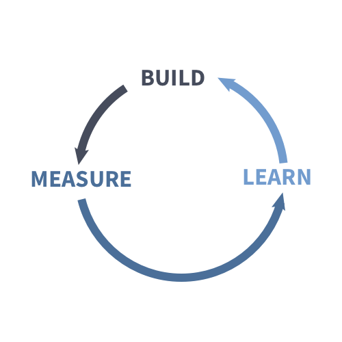
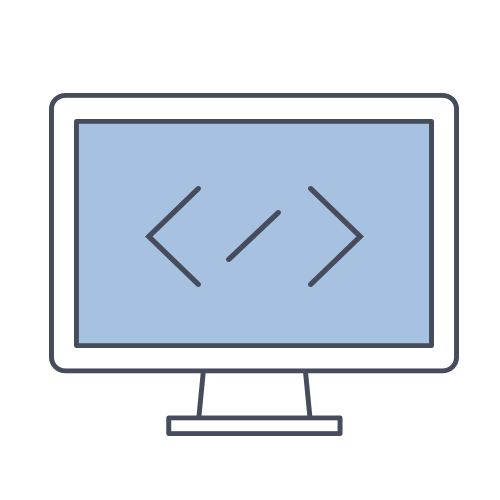

<!-- 

  <a class="maincontent-anchor" id="top" href="#MainContent"><i class="fas fa-caret-down"></i></a>
  
 -->

<!-- <section class="hero">

  <a class="maincontent-anchor" id="top" href="#MainContent"><i class="fas fa-caret-down"></i></a>
  

</section>
-->

<!--

  
  

  <a class="maincontent-anchor" id="top" href="#MainContent"><i class="fas fa-caret-down"></i></a>
  

 -->

  

    

      
    

    

      <h2> Our Playbook </h2>
      <h3>Build | Measure | Learn</h3>
      
 Our core competencies, role descriptions, practices and methodologies for DID(it) enterprise software development success 

      
<a href="playbook">More...</a>

    

  

  

    

      <h2> Our Product Managers </h2>
      
 A product manager communicates product vision from the highest levels of executive leadership to development and implementation teams. 

      
<a href="product-management">More...</a>

    

    

      
    

  

  

    

      
    

    

      <h2> Our Designers </h2>
      
 Unlike UX designers who are concerned with the overall feel of the product, user interface designers are particular about how the product is laid out. They are in charge of designing each screen or page with which a user interacts and ensuring that the UI visually communicates the path that a UX designer has laid out.

      
<a href="design">More...</a>

    

  

    

  <h2>Our Engineers</h2>
  
Front and back ends. In software engineering, the terms front end and back end refer to the separation of concerns between the presentation layer (front end), and the data access layer (back end) of a piece of software, or the physical infrastructure or hardware.

  
<a href="engineering">More...</a>

      
    

    

    

  

    

          
    

    

  <h2> Our Leadership </h2>
      
 An effective leader is a person who does the following: Creates an inspiring vision of the future, and motivates and inspires people to engage with that vision. 

      
<a href="leadership">More...</a>
    

  

