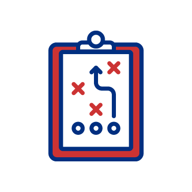
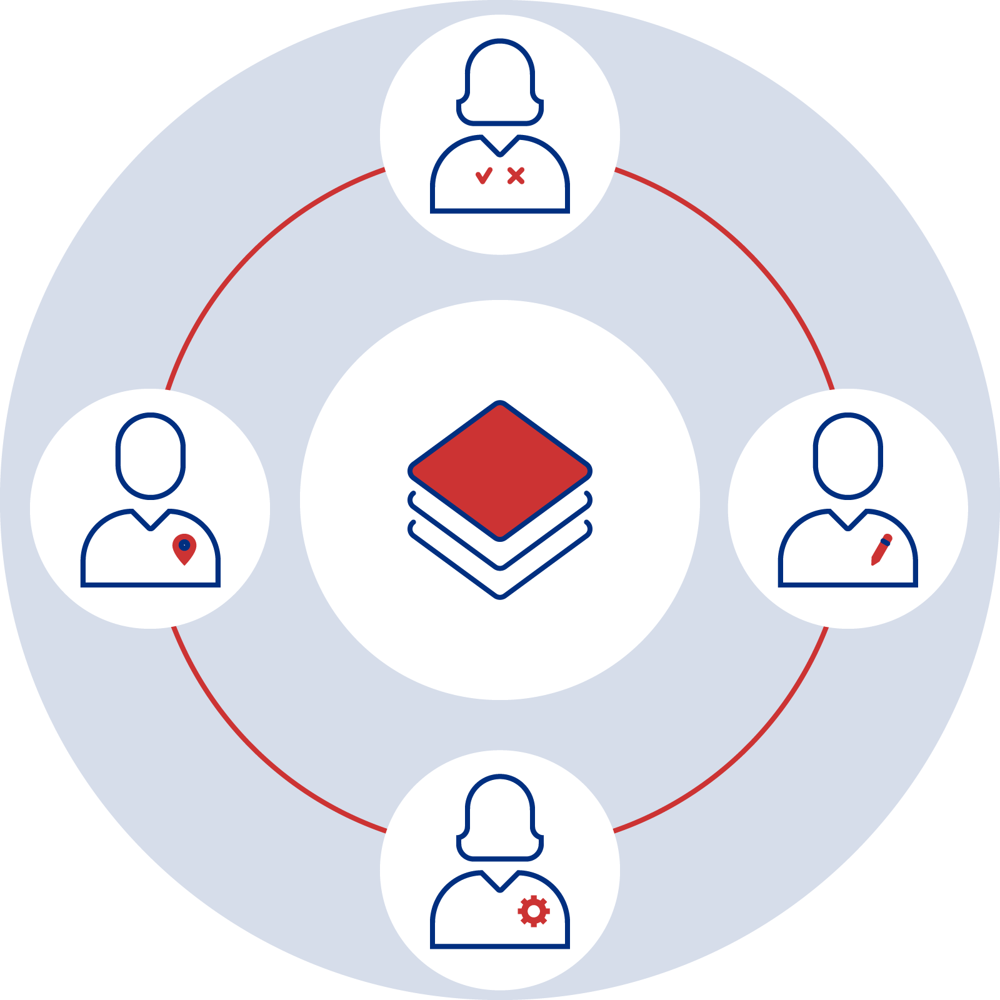
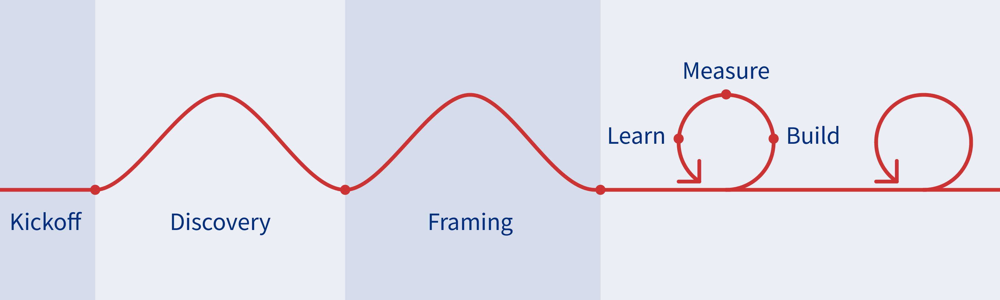

<!-- main content -->
<main class="usa-grid usa-section usa-content usa-layout-docs" id="main-content">

    <!-- hero -->
    <section class="usa-section usa-graphic_list usa-section-dark">
        

            

                

                    
                

            

            

                

                    <h1 class="bar-top">DID(it) Playbook</h1>
                    

                        The purpose of this playbook is to introduce new practitioners to the best practices of DID(it).
                    

                

            

        

    </section>
    <!-- //hero -->

    <!-- page content -->
    

        <!-- section-action -->
        

            

                

                    <h2>Players Lineup</h2>
                    

                        Think of a product team as a cross-functional group responsible for planning, delivering and maintaining successful products. A typical product team is led by the product manager, and includes leaders from design, engineering, and customers.
                    

                    <a class="usa-button" href="{{ site.baseurl }}/v2/players" class="card-cta link-arrow-right" tabindex="0">
                        Read more
                        about Players Lineup
                    </a>
                

                

                    
                

            

        

        <!-- //section-action -->

        <!-- section-action -->
        

            

                

                    <h2>Playlist</h2>
                    

                        Drive consistency and reduce risk by following standard procedures.
                    

                    <a class="usa-button" href="{{ site.baseurl }}/v2/playlist" class="card-cta link-arrow-right" tabindex="0">
                        Read more
                        about Playlist
                    </a>
                

            

            

                

                    
                

            

        

        <!-- //section-action -->

    
<!-- //usa-width-three-fourths -->
</main><!-- //main content -->

